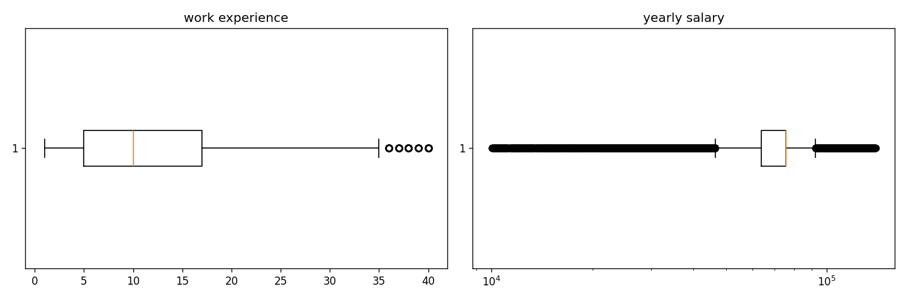
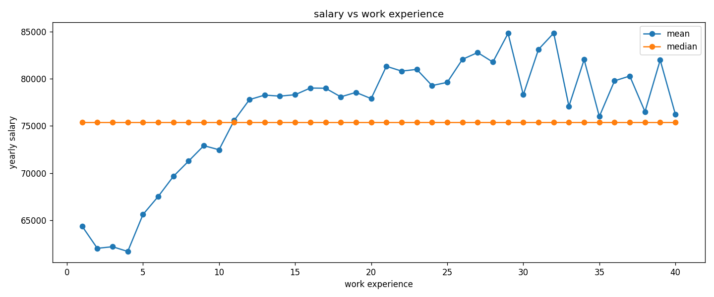
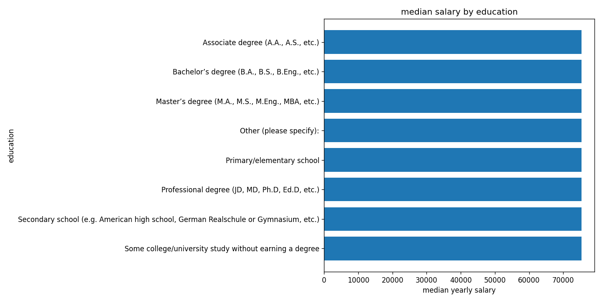
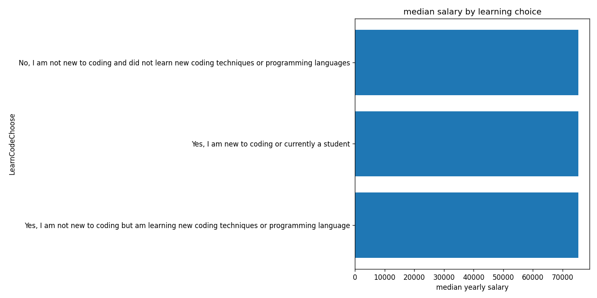
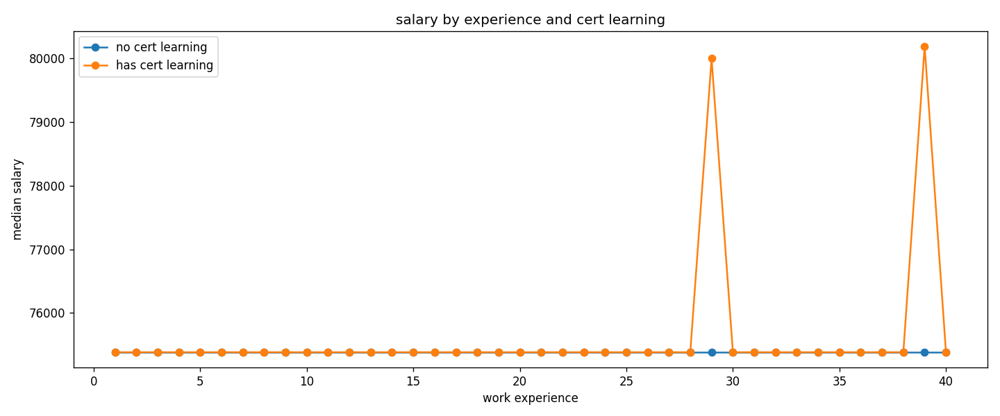
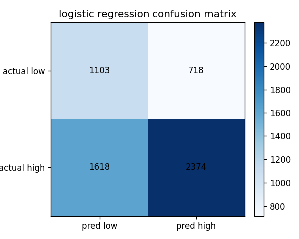
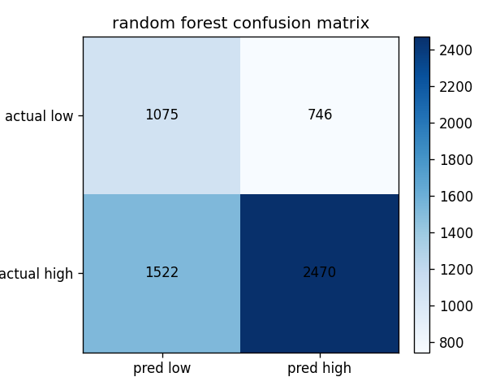
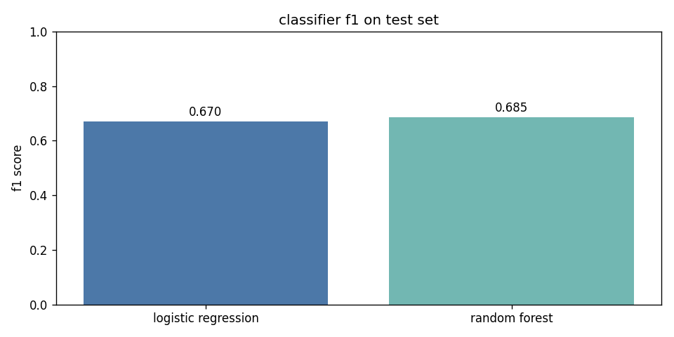

# Stack Overflow Developer Survey

First Python and data practice. Not meant to be anything serious, just learning.

## ToC:

- [stack overflow developer survey](#stack-overflow-developer-survey)
  - [the data](#the-data)
  - [how this was started](#how-this-was-started)
  - [jupyter kernel](#jupyter-kernel)
  - [verify the setup](#verify-the-setup)
  - [summary](#summary)
    - [what this assignment is about](#what-this-assignment-is-about)
    - [the data and cleaning](#the-data-and-cleaning)
    - [what was found in exploration](#what-was-found-in-exploration)
    - [the classification models and results](#the-classification-models-and-results)
    - [extra regression models](#extra-regression-models)
    - [how to read the repo](#how-to-read-the-repo)
  - [assignment steps](#assignment-steps)
    - [1. dataset](#1-dataset)
    - [2. read the data](#2-read-the-data)
    - [3. missing values](#3-missing-values)
    - [4. duplicates](#4-duplicates)
    - [5. outliers](#5-outliers)
    - [6. text to numbers](#6-text-to-numbers)
    - [7. split into x and y](#7-split-into-x-and-y)
    - [8. one notebook per algorithm](#8-one-notebook-per-algorithm)
    - [9. first model: logistic regression](#9-first-model-logistic-regression)
    - [10. evaluation: classification_report](#10-evaluation-classification_report)
    - [11. f1 score](#11-f1-score)
    - [12. support](#12-support)
    - [13. imbalance](#13-imbalance)
    - [14. second model and comparison](#14-second-model-and-comparison)

---

## The data

This project uses one main dataset as a whole, not a story told file by file.

| where it came from | what it is | why it was used | what was done with it |
|--------------------|------------|-----------------|----------------------|
| [stack overflow annual developer survey on kaggle](https://www.kaggle.com/datasets/edoardogalli/stack-overflow-annual-developer-survey-2025?resource=download). a zip was downloaded and the contents were placed under `data/` | anonymous answers from developers around the world: one row per person, many questions about work, skills, pay in us dollars, education, and how they learned to code. the public export has on the order of tens of thousands of rows and well over a hundred columns | it fits the assignment rules (large mixed table, missing values, text and numbers). it is used to check whether experience and background answers line up with salary, and whether high vs low pay can be predicted from a small set of fields | the public results table was loaded in `analysis.ipynb`, most columns were dropped, missing values were filled, duplicates and outliers were removed, then a smaller cleaned table was saved. model code reads that cleaned table through `utils.py`. details of cleaning and modeling are in the summary and assignment sections below |

The zip also includes a small schema file that explains column names. Raw csv files are often gitignored. See `data/readme.md` for the kaggle link.

---

## How this was started

Python from: [Python 3.12.13 downloads](https://www.python.org/downloads/release/python-31213/).

The dataset is the Stack Overflow annual developer survey on Kaggle: [dataset on Kaggle](https://www.kaggle.com/datasets/edoardogalli/stack-overflow-annual-developer-survey-2025?resource=download). After downloading, the files were placed under `data/`, including `survey_results_public.csv` and anything else that came with the archive.

From this folder, an environment was created:

```bash
python3 -m venv ds-env
```

Dependencies were installed with the environment activated:

```bash
source ds-env/bin/activate
pip install jupyter pandas matplotlib scikit-learn
jupyter notebook
```

> Jupyter opened in the browser on: [http://localhost:8888/tree](http://localhost:8888/tree).

## Jupyter kernel

**In the Jupyter UI:**
new, then a Python notebook. The kernel was pointed at the `ds-env` environment when the default interpreter was not the venv (shown as "Python 3 (ds-env)" after `ipykernel` is available). The notebook file was renamed.

## Verify the setup

This was run in a cell to confirm pandas could read the public results file:

```python
import pandas as pd

df = pd.read_csv("data/survey_results_public.csv")
df.head()
```

The first rows appear in the notebook output when that cell is run in `analysis.ipynb`.

---

## summary

This section explains what the project is about, what was done to the data, what showed up in the tables and charts, and how the machine learning models performed. Everything here comes from running the notebooks in this repo on the stack overflow developer survey.

Figures are in `figures/`. Regenerate them with `python scripts/export_readme_figures.py` after updating `data/cleaned_developer_survey.csv`.

### what this assignment is about

Developers in the survey answered questions about their job, education, and how they learned to code. They also reported yearly pay in united states dollars. This project looks at whether pay lines up with years of work experience, highest education level, and answers about learning and online courses or certifications.

The main machine learning question is classification. Each person gets a label of high salary or low salary. High means their pay is at or above the median pay in the cleaned table. Low means below that median. The models try to guess that label using experience and the learning related answers. This is not the same as guessing the exact dollar amount, which is what the extra regression notebooks try as a side experiment.

### the data and cleaning

The raw public file had about 49123 rows and 170 columns. Most columns were dropped. Five were kept for this work. Work experience in years, education level, a field about whether the person is new to coding or still learning, a longer field about how they learn, and yearly pay.

Cleaning filled missing pay and missing work years with the median value for that column. Missing text answers were filled with the most common answer in that column. Duplicate rows were removed. Outliers on work years and pay were removed using boxplots and the usual interquartile range rule at 1.5 times the spread below the lower quartile and above the upper quartile. After cleaning there were about 22122 rows. The cleaned file is `data/cleaned_developer_survey.csv`.



Big raw files from Kaggle are listed in `.gitignore` so they do not land in git. `data/readme.md` links the Kaggle page.

### what was found in exploration

The survey is one snapshot in time. A higher average pay for one group does not prove that group caused higher pay. It only shows how answers lined up in this file.

Work experience and pay move together in a broad way. Mean pay rises as years on the job increase in the summary tables. Many grouped medians sit near the overall median after cleaning because missing pay was filled with that median, but the pattern still shows that more years on the job is associated with higher typical pay in this sample.



Education level also lines up with pay. In the education summary, professional degree answers have the highest mean pay in this export at about 75587 dollars. Master degree answers are next at about 74141 dollars. Bachelor and associate answers are lower. Primary and secondary school answers are lower still.



The learning choice field is about whether someone is new to coding or still learning new languages or skills. People who said they are not new and are not learning new techniques right now had the highest mean pay in this export at about 73938 dollars. People who are experienced but still learning had a similar mean at about 71970 dollars. People who said they are new or still a student had a lower mean at about 71411 dollars in this table, with fewer rows in that group.



The notebook also checks whether the long learn field mentions online courses or certification. Median pay by work years is plotted for people with and without that mention. Experience and education show clearer steps in the tables than the self reported learning labels alone.



### the classification models and results

For machine learning, the features are work years, education level, the learning choice field, the long learn field, and a yes or no flag built from whether the learn field mentions online courses or certification. The target for classification is not the dollar amount. It is 1 for high salary at or above the median and 0 for low salary below the median.

About 69 percent of rows in the full cleaned set are the high salary class and about 31 percent are low. The data is imbalanced. The train and test split uses stratify so both sets keep a similar mix. Both classifiers use balanced class weights so the model does not ignore the smaller low salary group. `imbalance_handling.ipynb` walks through that setup step by step: class counts, stratified split, support on the test set, then both classifiers with `classification_report` output (same inputs as `analysis.ipynb`).

The test set has 5813 rows. About 1821 are low salary and about 3992 are high salary. Metrics below are on that held out test set.

Precision means of the rows the model called low, how many were truly low. Recall means of all truly low rows, how many the model found.

<table>
  <tr>
    <th>logistic regression</th>
    <th>random forest classifier</th>
  </tr>
  <tr>
    <td>
      <code>models/logistic_regression.ipynb</code> and the same block at the end of <code>analysis.ipynb</code><br><br>
      accuracy about 0.60<br>
      f1 score about 0.67<br>
      low class: precision 0.41, recall 0.61<br>
      high class: precision 0.77, recall 0.59
    </td>
    <td>
      <code>models/random_forest_classifier.ipynb</code><br><br>
      accuracy about 0.61<br>
      f1 score about 0.69<br>
      low class: precision 0.41, recall 0.59<br>
      high class: precision 0.77, recall 0.62
    </td>
  </tr>
  <tr>
    <td></td>
    <td></td>
  </tr>
</table>

which classifier did better

Random forest classifier scored slightly higher on accuracy and f1 on this run. Both models predict the high salary class more confidently than the low class, which is common when the high class is more than twice as large in the test set.



Neither model is perfect. They are better than random guessing but still confuse many low and high cases. That fits a hard real world problem where pay depends on many things not in these five columns.

### extra regression models

Three notebooks predict pay as a number instead of high or low. They use mean absolute error, root mean squared error, and r squared on the test set.

The median baseline always predicts the same median pay. It got mean absolute error about 16061 dollars and r squared about negative 0.016 on this run.

ridge regression got mean absolute error about 18196 dollars and r squared about 0.034.

random forest regressor got mean absolute error about 17912 dollars and r squared about 0.051.

The tree regressor was best among the regressors but only explains a small share of variance. The baseline had the lowest mean absolute error here because many salaries cluster near the median after cleaning. These regression runs are extra. The assignment focus is the two classifiers above.

### how to read the repo

1. `analysis.ipynb` loads, cleans, explores, saves the cleaned csv, and runs both classifiers with printed metrics and plots.
2. `imbalance_handling.ipynb` focuses on assignment step 13: shows imbalance in the full label counts, stratified train/test split, support table, and both classifiers with `class_weight="balanced"` and printed `classification_report` tables (code cells only, with a comment block at the top of each cell).
3. `utils.py` holds shared load, split, preprocessing pipeline, and metric helpers.
4. `models/logistic_regression.ipynb` and `models/random_forest_classifier.ipynb` train and evaluate each classifier on their own.
5. `scripts/export_readme_figures.py` rebuilds all png files under `figures/`.
6. `data/results_*.csv` stores numeric outputs from the runs that produced this summary.

`analysis.ipynb` is run first, then `imbalance_handling.ipynb` or the model notebooks, with restart and run all so paths and imports stay consistent. `imbalance_handling.ipynb` needs `data/cleaned_developer_survey.csv` from `analysis.ipynb` but does not change the cleaned file.

---

## Assignment steps

This is the same order as the course project list. Main work is in `analysis.ipynb`. Models are in `models/` and share prep through `utils.py`. Full findings and figures are in the summary above.

### 1. Dataset

Stack Overflow Developer Survey from Kaggle. More than 1000 rows (about 49000 in the raw file). Mix of numbers and text. Lots of missing values so cleaning was needed.

### 2. Read the data

In `analysis.ipynb`:

- `pd.read_csv("data/survey_results_public.csv")`
- `df.shape`
- `df.info()`
- `df.head()`

That shows row count, column count, dtypes, and a quick look at the table.

### 3. Missing values

- `df_selected.isnull().sum()` (same idea as `isna().sum()`)
- Numeric columns: **median** (`WorkExp`, `ConvertedCompYearly`)
- Text columns: **mode** (`EdLevel`, `LearnCodeChoose`, `LearnCode`)

### 4. Duplicates

- `df_selected.duplicated().sum()`
- `drop_duplicates()` when duplicates exist

### 5. Outliers

- Boxplots for `WorkExp` and `ConvertedCompYearly`
- IQR rule and filter rows outside the fences

### 6. Text to numbers

- `pd.get_dummies()` on the text columns in `analysis.ipynb`
- Model notebooks use one hot encoding inside the sklearn pipeline (same idea)

### 7. Split into X and y

For **classification** (high vs low salary):

- `y` = 1 if salary is at or above the median, else 0
- `train_test_split(..., stratify=y)` so train and test keep similar class mix

Done in `utils.py` and used by the model notebooks. `analysis.ipynb` also has a split cell for exploring the table.

### 8. One notebook per algorithm

All the notebooks use the same cleaned dataset file:

`data/cleaned_developer_survey.csv`

This file is created before running the model notebooks. The notebooks do not use the raw dataset directly. They use the cleaned version because the data needs to be prepared first before ml can work correctly.

The same input features are used in the model notebooks. These are the columns that the model uses to learn from:

- `WorkExp`
- `EdLevel`
- `LearnCodeChoose`
- `LearnCode`
- a flag that shows whether the developer learned through certification

In simple words, these columns describe things about the developer, such as work experience, education level, and how they learned to code. The model then uses this information to try to make a prediction.

| notebook | explanation |
|----------|-------------|
| `imbalance_handling.ipynb` | this notebook is for assignment step 13 (imbalance). it shows how many rows are low vs high salary in the full cleaned data, then uses `get_classification_split()` with `stratify=y` and a test-set support table. it trains logistic regression and random forest classifier with `class_weight="balanced"`, saves the same `data/results_*.csv` files as the other classification notebooks, and prints sklearn `classification_report` tables (precision, recall, f1-score, support). it uses the same `utils.py` helpers and the same model settings as `analysis.ipynb`. each code cell starts with a detailed comment explaining what that cell does. |
| `models/logistic_regression.ipynb` | this notebook uses logistic regression, which is a classification algorithm. it tries to predict if the salary is high or low. the salary is divided using the median value, so salaries above the median are treated as one group and salaries below the median are treated as another group. it creates `data/results_logistic_regression.csv` and shows results like the classification report, support table, confusion matrix, accuracy, and f1 score. |
| `models/random_forest_classifier.ipynb` | this notebook uses random forest classifier, which is also a classification algorithm. it predicts the same thing as logistic regression, which is whether the salary is high or low. it creates `data/results_random_forest_classifier.csv` and shows similar results such as accuracy, f1 score, support table, and confusion matrix. this helps compare random forest classifier with logistic regression. |
| `models/ridge_regression.ipynb` | this notebook uses ridge regression, which is a regression algorithm. instead of predicting only high or low salary, it tries to predict the actual salary value as a number. it creates `data/results_ridge_regression.csv` and shows mae, rmse, and r2. these results help show how close the predicted salaries are to the real salaries. |
| `models/random_forest.ipynb` | this notebook uses random forest regressor, which is a regression algorithm. it also tries to predict the real salary amount as a number. it creates `data/results_random_forest.csv` and shows mae, rmse, and r2, so it can be compared with the other regression notebooks. |
| `models/baseline_median.ipynb` | this notebook uses a median baseline model. it is a very simple regression approach because it always predicts the median salary value. it creates `data/results_baseline_median.csv` and shows mae, rmse, and r2. this is used as a simple starting point to check if the real models are better than a basic guess. |

btw, the most important notebooks for the assignment are the classification work:

* `imbalance_handling.ipynb` (step 13: imbalance, stratify, balanced weights, classification reports)
* `models/logistic_regression.ipynb`
* `models/random_forest_classifier.ipynb`

These are the main notebooks because the question is about predicting whether a developer has a high or low salary. This is a classification problem because the output is a category, not an exact number

The regression notebooks are extra work. They try to predict the salary as an actual number. This means they are not answering the high vs low salary question directly. They were added to test another approach and to see how well salary can be predicted as a number.

The baseline median notebook is also useful, but it is not a strong ml model. It is only a simple comparison point. If a real model cannot perform better than always guessing the median salary, then the real model is not very useful.

The correct running order is:

1. `analysis.ipynb` is run first.
   This notebook prepares the data and creates: `data/cleaned_developer_survey.csv`

2. `imbalance_handling.ipynb` can be run next (or anytime after the cleaned csv exists).
   This notebook documents step 13 and prints classification reports for both classifiers on the stratified test set.

3. `models/logistic_regression.ipynb` is run.
   This trains and evaluates the logistic regression classification model.

4. `models/random_forest_classifier.ipynb` is run.
   This trains and evaluates the random forest classification model.

5. The regression notebooks are run only if the extra regression results are needed:
   `models/baseline_median.ipynb`, `models/ridge_regression.ipynb`

   `models/random_forest.ipynb`

so, for the main assignment topic, the focus is on logistic regression and random forest classifier. The regression notebooks can be mentioned as extra experiments, but they are not the main solution for the high salary vs low salary prediction task.

### Steps inside each classification notebook

Both classifiers use the same data loading, target, split, and preprocessing from `utils.py`. Only the last step of the pipeline changes (linear model vs tree ensemble).

**Steps that are the same for both**

1. Read `data/cleaned_developer_survey.csv` with `load_ml_dataframe()`.
2. Keep the feature columns `WorkExp`, `EdLevel`, `LearnCodeChoose`, `LearnCode`, and a boolean `HasCertificationLearning` built from whether `LearnCode` mentions online courses or certification.
3. Drop rows with missing salary or missing `WorkExp`.
4. Build the label with `make_high_salary_label()`: 1 if salary is at or above the median in this cleaned table, 0 otherwise.
5. Split with `get_classification_split()`: 80 percent train and 20 percent test, `stratify=y` so each split has similar counts of high and low labels.
6. Build one pipeline with `build_pipeline(estimator)`: preprocessing then the model.
7. Fit on the training rows, predict on the test rows, then print metrics and save `data/results_*.csv`.

**How text is turned into numbers before logistic regression sees anything**

Logistic regression in sklearn only accepts numeric input. Text columns never go in as raw strings inside the model step.

1. **Before the sklearn pipeline** (`load_ml_dataframe()` in `utils.py`): missing answers in `EdLevel`, `LearnCodeChoose`, and `LearnCode` are filled with the most common answer (mode) for that column, then stored as strings. The certification flag is true or false.

2. **Inside the pipeline** (`build_preprocess()`): a `ColumnTransformer` sends different columns down different paths.
   - `WorkExp` is numeric: missing values imputed with the median on the training part, then scaled with `StandardScaler` so years are on a similar scale to other inputs.
   - All categorical columns (`EdLevel`, `LearnCodeChoose`, `LearnCode`, `HasCertificationLearning`) go through `OneHotEncoder`. Each category that appears often enough in training becomes its own binary column (1 if this row has that answer, 0 otherwise). The setting `min_frequency=20` groups rare answers so the model does not get too many columns. `handle_unknown="ignore"` means when the test set has a new answer string that never appeared in training, those dummy columns stay zero and the encoder does not error.

So for logistic regression, text handling is **one hot encoding** of categories after simple fill rules, not free text embedding. The notebook `analysis.ipynb` uses `get_dummies()` for charts and tables, which is the same basic idea as the encoder in the pipeline.

**Steps specific to logistic regression**

1. Create `LogisticRegression(max_iter=2000, class_weight="balanced", random_state=42)`.
2. Wrap it in `build_pipeline(...)`, call `fit` on `X_train, y_train`, then `predict` on `X_test`.
3. The model learns one weight per numeric and per dummy column so it can output a probability of class 1 (high salary) and pick high or low.

**Steps specific to random forest classifier**

1. Create `RandomForestClassifier` with `n_estimators=200`, `min_samples_leaf=10`, `class_weight="balanced"`, `n_jobs=-1`, `random_state=42`.
2. Use the **same** `build_pipeline(...)` so text and numbers are encoded the same way as for logistic regression.
3. Many decision trees vote on the class. Trees split on individual dummy bits and on scaled `WorkExp`, not on raw strings.

### 9. First model: logistic regression

- `LogisticRegression(class_weight="balanced")`
- `pipeline.fit(X_train, y_train)`
- `y_pred = pipeline.predict(X_test)`

### 10. Evaluation: `classification_report`

```python
print(classification_report(y_test, y_pred, target_names=["low", "high"]))
```

Shows precision, recall, f1-score, and support per class.

### 11. F1 score

Main metric for comparison. Higher is better (closer to 1). Saved in `data/results_logistic_regression.csv` and `data/results_random_forest_classifier.csv`.

### 12. Support

Support is how many test rows are in each class (0 = low salary, 1 = high salary). Shown in the report and in a small `support_table` in the model notebooks. If one class has many fewer rows, the data is imbalanced.

### 13. Imbalance

- `stratify=y` on the split
- `class_weight="balanced"` on logistic regression and random forest
- `imbalance_handling.ipynb` at the repo root: cell 1 shows class counts and shares in the full dataset; cell 2 runs `get_classification_split()` and a `support_table` for the test set; cells 3–4 fit logistic regression and random forest with the same pipelines as `analysis.ipynb` and print `classification_report` (f1-score per class is the main metric to read when classes are uneven)

### 14. Second model and comparison

Random forest classifier in `models/random_forest_classifier.ipynb`. Compared with logistic regression on accuracy, f1 score, and confusion matrix. See summary for figures and scores. On this run random forest had slightly higher f1.